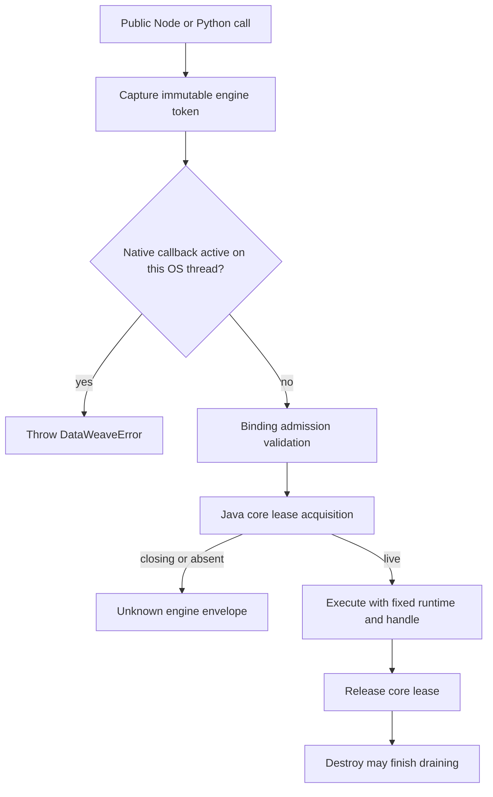
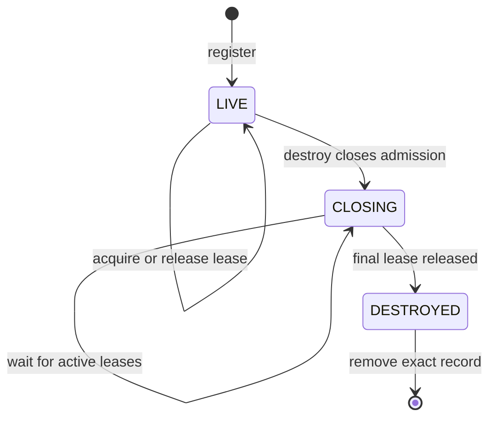
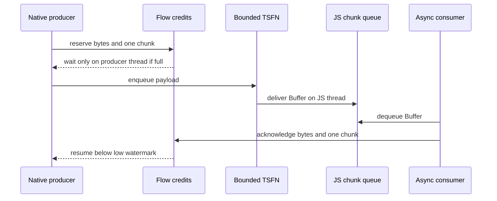
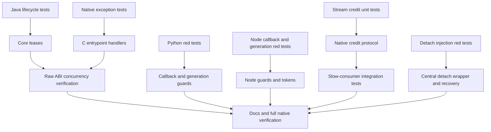

# PR #157 Review 22 Remediation Design

**Date:** 2026-09-02
**Status:** Approved for implementation
**Base branch:** `w-23692110-multi-engine-design` at `6661b96`
**Fix branch:** `w-23692110-review-22-fixes`
**PR target:** `w-23692110-multi-engine-design`
**Source:** `docs/pr-157-follow-up-code-review-22.md`

## Goal

Resolve all eight open findings from PR #157 review 22 without changing valid-input behavior or the public Node and Python APIs. The result must prevent host-process termination, make engine destruction safe for direct C ABI consumers, bind accepted operations to one engine generation, bound Node streaming memory, cover detach-poison recovery, and pass repository whitespace checks.

## Scope

In scope:

- Finding 1: reject same-OS-thread DataWeave lifecycle or execution reentrancy from a native host callback in Node and Python.
- Finding 2: contain every Java `@CEntryPoint` throwable behind an explicit ABI sentinel.
- Finding 3: make Python operation admission atomic with lifecycle generation validation.
- Finding 4: give every Java engine a core-owned lifecycle record and operation leases.
- Finding 5: bind Node and Python lazy streams to the generation present at stream creation.
- Finding 6: bound Node output buffering across both the native TSFN queue and the JavaScript chunk queue.
- Finding 7: add deterministic failure-injection coverage for Node's detach-poison transitions.
- Finding 8: remove the two whitespace errors in the PR diff.
- Update native-lib, Node, Python, and consolidated design documentation for changed contracts.

Out of scope:

- Separate GraalVM isolates per engine.
- Enabling custom module resolvers in background streaming or transform workers.
- Changing public `DataWeave` method names, parameters, or result envelopes.
- Retaining compatibility with removed pre-GA singleton C entrypoints.
- Making application-retained output buffers part of the binding's memory bound.
- Guaranteeing bounded total DataWeave runtime memory for non-deferred scripts that materialize output before callback delivery.

## Global Constraints

- Use the checked-in `./gradlew` wrapper and GraalVM Community Java 24 for native verification.
- Java remains source/target 17; Scala remains 2.12; Python remains 3.9+; Node remains 18+.
- Preserve exported C names, argument order, callback semantics, and existing JSON wire fields.
- Normal script failures continue to return non-null `{"success":false,...}` envelopes.
- Never let Java, JavaScript, or Python exceptions unwind across C callbacks.
- Every OS thread calling Graal attaches its own isolate thread and detaches afterward unless a successful teardown has invalidated the attachment.
- Node shared C lifecycle state remains guarded by `g_mutex`; per-stream flow state uses its own mutex with explicit lock ordering.
- Python module isolate state remains guarded by `_isolate_lock`; user callbacks run without module locks held.
- All behavior changes use test-first red-green cycles.

## Architecture



The binding token prevents work accepted by one object generation from migrating to a replacement engine. The Java lease independently protects the raw ABI and resolver context even when callers bypass the bindings. These mechanisms are deliberately additive: neither replaces Node bridge pinning, Python instance serialization, or isolate reference accounting.

## 1. Java C Entrypoint Exception Containment

### Problem

The exported methods in `NativeLib` use GraalVM's default `CEntryPoint.FatalExceptionHandler`. A recoverable Java validation error, such as a null resolver callback, therefore prints a fatal error and exits the embedding process instead of returning to C.

### Design

Add one package-private `CEntryPointExceptionHandlers` support class containing three nested handler classes. Each nested class declares exactly one static `@Uninterruptible` handler method, performs no allocation or logging, and returns one ABI-category sentinel:

| Category | Sentinel | Entrypoints |
|---|---|---|
| Engine handle | `0L` | `create_engine`, `create_engine_with_resolver` |
| Result pointer | null `CCharPointer` | all three `run_*_engine` methods |
| Void | return | `destroy_engine`, `free_cstring` |

Expected validation failures should still be handled in the entrypoint body and represented as ordinary error envelopes when allocation remains safe. The custom exception handler is the non-allocating last resort for unexpected throwables or a failure while constructing an envelope.

The ABI contract becomes explicit:

- Engine handles are positive; `0` means creation failed and no engine was registered.
- A null run-result pointer means the entrypoint could not create a JSON result. The caller must not free it.
- Unknown, closing, or destroyed handles return the existing non-null `Unknown engine handle` envelope.
- `free_cstring(NULL)` remains a no-op.

### Tests

- A native subprocess calls `create_engine_with_resolver(thread, NULL, NULL)`, observes `0`, then creates and uses a valid engine in the same process.
- Native malformed-pointer coverage observes a null result instead of process exit where a safe deterministic trigger exists.
- A hosted reflection test verifies every export names a non-default handler of the correct category.
- Native compilation validates GraalVM's handler shape and `@Uninterruptible` requirements.

## 2. Core Engine Lifecycle Records and Leases

### Problem

`ScriptRuntime.get(handle)` and `ScriptRuntime.destroy(handle)` are unrelated map operations. A raw C run can retain the Java runtime, then a concurrent destroy can remove the registry entry and return. The caller may free the resolver `ctx` while the admitted run later invokes it.

### Design

Change the Java registry value from a bare `ScriptRuntime` to an `EngineRecord` with this lifecycle:



`ScriptRuntime.acquire(long handle)` returns an `EngineLease` only when the record is `LIVE`. The state check and active-lease increment occur under the record monitor. `EngineLease` implements `AutoCloseable`, exposes the fixed `ScriptRuntime`, and releases exactly once.

Every `run_*_engine` entrypoint acquires a lease before converting required pointers or invoking the runtime and closes it with try-with-resources. The lease spans resolver calls, streaming callbacks, transform feeder cleanup, and final result allocation. It can end before `free_cstring()` because the returned allocation no longer depends on the engine.

`destroy_engine` atomically changes `LIVE` to `CLOSING`, rejects later acquisitions, and waits until all admitted leases close. It continues waiting through interruption and restores the interrupt status only after lifetime safety has been re-established. Concurrent destroy calls coordinate on the same record. Exact-record map removal occurs only after `DESTROYED`.

The public raw ABI contract is:

- `destroy_engine` is idempotent for unknown or already destroyed handles.
- `destroy_engine` can block until all previously admitted operations finish.
- Resolver and callback contexts must remain valid through `destroy_engine` return and may be freed afterward.
- Calling `destroy_engine` for an engine synchronously from one of that engine's callbacks is prohibited because the callback owns a lease that destroy must drain.

Node's `engine_bridge_t.in_flight` remains necessary for N-API reference and resolver-bridge lifetime. Python operation serialization remains necessary for wrapper lifecycle and generation correctness.

### Tests

- Hosted Java tests prove admission rejection after close, multiple-lease drain, concurrent destroy, interrupted wait restoration, and lease release on thrown bodies.
- A raw ctypes subprocess blocks inside a real resolver callback, calls destroy on another OS thread, and proves destroy does not return until the callback and run finish.

## 3. Native Callback Reentrancy Guards

### Problem

A synchronous resolver invokes host JavaScript or Python while the outer Graal call is active. If host code invokes DataWeave on another engine on the same OS thread, the nested call attaches and detaches that thread. The outer call then resumes with invalid Graal thread state and terminates the process.

The same hazard applies to lifecycle operations and other synchronous host callbacks that can enter another engine.

### Node Design

Add addon-level OS-thread-local callback depth using `uv_key_t`, initialized through the existing `uv_once` setup. Enter the scope immediately around each direct host callback invocation and restore it on every status or exception path.

Before any entrypoint attaches, detaches, creates, destroys, or admits DataWeave work, reject when callback depth is nonzero. The addon throws an error with a stable internal code such as `ERR_DATAWEAVE_CALLBACK_REENTRANCY`. The TypeScript layer maps that code to the public `DataWeaveError` class.

The C guard is authoritative because raw addon users and duplicate package copies must not bypass it. A process-global boolean is forbidden because independent Worker OS threads must remain concurrent.

### Python Design

Add module-level `threading.local()` callback depth shared by all `NativeRuntime` instances. Apply the scope directly around user resolver, read, and write callback invocation. Check the scope before public lifecycle mutation, operation-token capture, and native serialized admission.

The guard fails before waiting on another engine's lock. A global execution mutex or `RLock` is not used because it would either deadlock or permit the unsafe reentry.

### Tests

- Node and Python isolated child processes attempt cross-engine nested `run()` from a resolver, catch `DataWeaveError`, return valid module source, and prove the outer run still succeeds with no fatal stderr.
- Tests cover uncaught resolver reentry, nested initialization, and raw addon/native admission where feasible.
- Unit tests prove callback depth is OS-thread-local and restored after callback errors.

## 4. Immutable Engine Generations

### Problem

Both bindings hold a mutable current handle. Python validates initialization before entering its operation lock. Node and Python lazy streams defer body execution until first iteration. Cleanup and reinitialization can therefore replace the engine between acceptance and admission, silently moving work from generation A to B.

### Shared Contract

Each successful engine initialization increments a monotonic binding-instance generation. Each operation captures an immutable token:

```text
EngineOperationToken { handle, generation }
```

Generation never resets during cleanup or failed initialization. Handle alone is insufficient because a newly created isolate can restart Java static handle allocation.

At native admission, the binding compares the token with the current initialized token while holding the lock that excludes lifecycle mutation. Native calls use the token's handle, never a later mutable field.

The race has two valid outcomes:

- Admission wins: work completes on its captured engine; cleanup waits or refuses while it is active.
- Cleanup wins: later token validation raises `DataWeaveError` for a stale engine generation; the replacement engine is never called.

### Python Design

Add frozen internal `_EngineOperation(handle: int, generation: int)` state to `NativeRuntime`. Public buffered, callback, transform, and stream methods capture this token synchronously. `_serialized_native_operation(expected)` validates it under the per-instance operation lock and yields the immutable token.

Stream worker registration validates the token atomically with `_stream_workers_lock` registration. If registration wins, cleanup sees the worker and follows current active-worker policy. If cleanup wins, registration rejects as stale. Lock order is `_stream_workers_lock` before the brief operation-token validation; native execution never reacquires `_stream_workers_lock` while holding the operation lock.

### Node Design

Add `engineGeneration` and `EngineOperationToken`. Convert `runStreaming` and `runTransform` from public async-generator methods into ordinary methods that capture the token at call time and return private async generators. The private generator validates the token immediately before synchronous native admission and invokes FFI with `token.handle`.

`runTransform` validates the same token before and after async input pre-buffering. The second check must occur immediately before FFI admission.

This intentionally changes stale or uninitialized stream failure timing to method call or first pull as documented by the concrete path; normal stream chunks and terminal metadata do not change.

### Tests

- Deterministic Python paused-admission test captures generation A, performs cleanup/reinitialize to B, resumes, and proves no call reaches handle B.
- Node and Python tests create a lazy stream, cleanup/reinitialize, then consume it and receive `DataWeaveError` before native invocation.
- Handle-reuse tests prove generation, not only numeric handle, controls identity.
- Transform tests pause during async pre-buffering and reject after generation replacement.
- Complementary tests prove already-admitted work finishes on its original engine.

## 5. End-to-End Node Output Backpressure

### Problem

The output TSFNs use `max_queue_size = 0`, and `streamFromNative` appends delivered buffers to an unbounded array. The native producer can outrun a paused consumer and retain output-sized memory even if one of those queues is later bounded independently.

### Design

Retain the push architecture and add one reference-counted `output_flow_t` per stream or transform operation. It tracks outstanding bytes and chunks from immediately before TSFN enqueue until the async generator dequeues the corresponding buffer.



Internal defaults are fixed initially rather than public configuration:

- High watermark: 1 MiB or 128 chunks.
- Low watermark: 512 KiB and 64 chunks.
- A single oversized chunk is admitted when the window is empty so it cannot deadlock permanently.

The output TSFN receives a finite queue capacity with room for normal outstanding chunks and the terminal sentinel. The native producer may wait on a per-flow condition variable; the JS thread only performs short acknowledge/cancel updates and never waits.

The internal FFI start contract returns an operation controller with:

```ts
interface NativeStreamingOperation {
  readonly completion: Promise<string>;
  acknowledge(bytes: number): void;
  cancel(): void;
  close(): void;
}
```

`streamFromNative` acknowledges a chunk when dequeuing it for delivery. This bounds binding-owned memory but not buffers retained by application code after `yield`.

Cancellation is mandatory because a producer blocked on credit cannot finish if the consumer abandons the stream. Generator `finally`, early `return()`, DataWeave cleanup, env teardown, and JS callback failure all cancel the flow, signal the producer, release queued credit exactly once, and allow native completion to settle. Cleanup semantics become cancel abandoned streams and drain their native completion, never wait indefinitely for consumer pulls.

Native flow lock ordering is:

- Never wait on the flow condition while holding `g_mutex`.
- If a path needs both locks, acquire `g_mutex` before the flow mutex and release the flow mutex before later global completion accounting.
- Refcounted flow ownership prevents callbacks, worker completion, cancellation, or TSFN finalization from freeing shared state twice.

### Tests

- TypeScript unit tests verify acknowledgment occurs only at dequeue, not JS enqueue; early return cancels; rejection drains accounted chunks; close/cancel are idempotent.
- Native test hooks expose current and peak outstanding bytes/chunks, pause, and cancellation state.
- Real integration tests pause a large deferred stream and transform, assert peak credits stay within the configured limit plus the one-oversized-chunk allowance, then resume and verify ordered complete output.
- Early generator return and cleanup of a paused stream complete under a bounded timeout and permit healthy reinitialization.
- The Node README writable-stream example waits for `drain` when `write()` returns false.

## 6. Detach-Poison Failure Injection

### Problem

The addon now poisons an isolate when ordinary detach returns nonzero, but no test forces the status. Cleanup skipping teardown, isolate abandonment, and fresh-isolate recovery are unverified.

### Design

Centralize ordinary detach calls behind `detach_thread_checked(detach_site_t, thread)`. Under `DATAWEAVE_TEST_HOOKS`, a site-specific one-shot injection calls the real detach first and, when it succeeds, substitutes a nonzero observed status. Production builds remain a thin wrapper over the real function.

Test-only counters record forced failures, isolate creation, teardown attempts, and isolate abandonment. Hooks expose state without making test behavior part of the product ABI.

The safe hook verifies the addon's response to a detach status; it does not claim to reproduce every physical consequence of a thread that truly remained attached.

Once poisoned, new DataWeave admission should fail closed rather than assume the isolate remains safe for new work. Already-produced triggering results may surface, active operations drain, final cleanup abandons the isolate without teardown, and later initialization creates a fresh isolate.

### Tests

- Child-process synchronous-run test forces one detach failure, observes poison, completes cleanup without teardown or hang, reinitializes, and runs successfully on a fresh isolate.
- Child-process transform test forces a background detach failure while final cleanup is waiting, proving deferred cleanup skips teardown and resolves.
- Lower-cost cases exercise create, resolver-create, bridge-finalize, and unknown-destroy detach sites where deterministic setup exists.

## 7. Whitespace and Documentation

Remove trailing spaces in `docs/superpowers/specs/2026-08-04-nodejs-external-modules-design.md` and the extra final blank line in `native-lib/python/src/dataweave/native.py` without unrelated formatting churn.

Update:

- `native-lib/README.md` with C sentinel, lease/drain, callback-context, and destroy-blocking contracts.
- `native-lib/node/README.md` with callback reentrancy, bounded streaming, cancellation, and writable `drain` guidance.
- `native-lib/python/README.md` with callback reentrancy and stale-generation behavior.
- `docs/superpowers/specs/2026-08-07-native-lib-multi-engine-design.md` so the final-state architecture uses core leases, immutable generation tokens, bounded flow control, and the new test-hook posture.

## Implementation Sequence



Use focused commits for independently reviewable behavior. The final PR contains the complete cohesive hardening set and targets `w-23692110-multi-engine-design`; do not squash unless requested during review.

## Verification Matrix

| Layer | Required verification |
|---|---|
| Java hosted | Focused lifecycle and existing `native-lib:test` suites |
| Native image | `native-lib:nativeCompile` with GraalVM Community Java 24 |
| Raw ABI | Isolated ctypes exception and resolver-context lease subprocess tests |
| Node unit | Generation, stream-credit, cancellation, and error mapping tests |
| Node integration | Resolver reentry, stale streams, slow consumer, cleanup, poison recovery |
| Node typecheck | `npm run build:ts` |
| Python unit | Token admission, callback TLS, worker registration, lifecycle tests |
| Python integration | Resolver reentry and stale real-native streams |
| Repository | `git diff --check w-23692110-multi-engine-design...HEAD` |

Run the smallest focused test after each red-green cycle, then the nearest module suite. Before PR creation, run Java, Node, Python, native-image, and diff verification from a clean branch and review every commit in the PR range.

## Risks and Mitigations

- **Destroy self-deadlock:** same-engine callback destroy waits for its own lease. Reject binding callback reentrancy and document the raw ABI prohibition.
- **Lease leak:** one missed close blocks destroy forever. Use try-with-resources in every entrypoint and tests that throw inside the leased body.
- **Flow-control deadlock:** waiting from the JS thread or while holding `g_mutex` prevents progress. Only the native producer waits, with explicit lock ordering and cancellation broadcasts.
- **Double free/use-after-free:** worker, TSFN callback, generator cancellation, and finalizer share flow state. Use reference counting and idempotent cancel/close transitions.
- **Generation false acceptance:** numeric handles can repeat after isolate replacement. Compare both monotonic generation and handle.
- **Fault-hook overclaim:** real detach then substitute failure validates status handling but not a physically attached dead thread. State this limitation in tests and docs.
- **Throughput regression:** high/low watermarks intentionally slow fast producers behind slow consumers. Integration tests verify correctness; benchmark only if normal-consumer throughput changes materially.
- **Native handler fragility:** GraalVM custom exception handlers have strict shape requirements. Keep handlers allocation-free and prove them through native compilation and subprocess execution.

## Success Criteria

- The three previously reproduced exit-99 cases remain alive and return documented errors or sentinels.
- Direct raw-ABI destroy cannot return while an admitted resolver callback may still use its context.
- No buffered, callback, streaming, or transform operation can migrate to a replacement engine generation.
- Node binding-owned output buffering remains within configured byte/chunk watermarks for paused consumers.
- Abandoned or cleanup-cancelled Node streams settle without deadlock.
- Forced ordinary detach failures poison and abandon the old isolate, skip unsafe teardown, and allow fresh initialization.
- Existing valid-input Node, Python, Java, native, and TCK behavior remains green.
- `git diff --check` passes for the full PR range.
